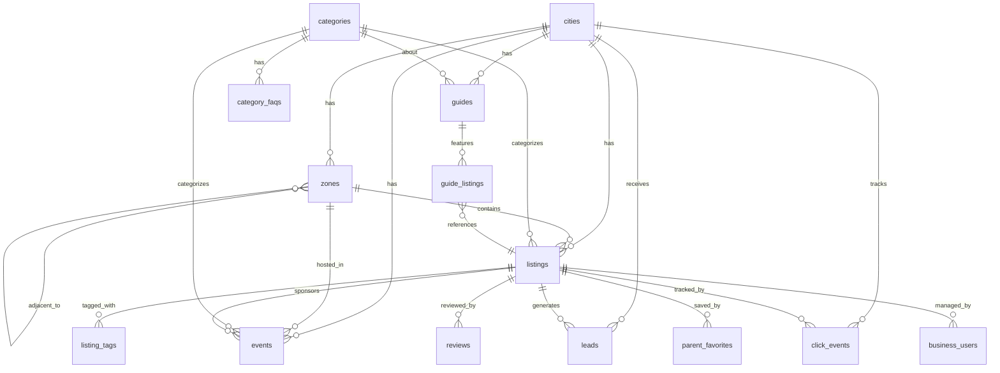

# ANTIGRAVITY.MD — Padres en España · Complete Project Reference

> **Last updated:** February 2026
> **Purpose:** Single source of truth for understanding every feature, structure, and design decision in this project. Use this file to onboard, plan features, and maintain consistency.

---

## 1. Product Overview

**Padres en España** is a **verified family directory platform** that helps parents in Spanish cities find trusted services for their children — summer camps, schools, extracurricular activities, sports clubs, family leisure, and healthcare.

### Core Value Proposition
- **Verified listings** curated by a team, not user-generated
- **Hyper-local** — organized by city → zone → category
- **SEO-first architecture** — programmatic pages for every category × zone combination
- **Lead generation** — parents contact businesses directly; interactions are tracked
- **Newsletter integration** — 40,000+ family subscribers (Madrid) via Beehiiv

### Business Model
| Revenue Stream | Mechanism |
|---|---|
| **Listing tiers** | `free` → `standard` → `presencia_anual` → `presencia_total` |
| **Featured placement** | `is_featured = true` listings appear first + golden border |
| **Lead delivery** | Parents submit info requests routed to businesses |
| **Click analytics** | Phone reveals, website clicks, WhatsApp clicks tracked per listing |
| **Partner portal** | External: `https://partners.padresenespana.com/directorio` |

### Multi-City Architecture
The platform is designed for **one deployment per city**, configured via environment variables:

| City | Domain | Status |
|---|---|---|
| Madrid | `padresenmadrid.com` | ✅ Active (40K subscribers) |
| Barcelona | TBD | 🔜 Planned |
| Valencia | TBD | 🔜 Planned |
| Bilbao | TBD | 🔜 Planned |
| Málaga | TBD | 🔜 Planned |
| Sevilla | TBD | 🔜 Planned |

---

## 2. Tech Stack

| Layer | Technology | Version |
|---|---|---|
| **Framework** | Next.js (App Router, SSR/SSG) | 14.2+ |
| **Language** | TypeScript | 5.5+ |
| **Database** | Supabase (PostgreSQL) | — |
| **Styling** | TailwindCSS | 3.4+ |
| **Icons** | Lucide React | 0.400+ |
| **Fonts** | DM Serif Display (headings), DM Sans (body) | Google Fonts |
| **Date utils** | date-fns + date-fns-tz | 3.6+ |
| **Hosting** | Vercel | — |
| **Newsletter** | Beehiiv (external subdomain) | — |
| **Email (planned)** | Resend | — |
| **Analytics (planned)** | Google Analytics | — |
| **Maps** | Google Maps embed (iframe) | — |

### Environment Variables
```env
# Supabase
NEXT_PUBLIC_SUPABASE_URL=         # Public Supabase URL
NEXT_PUBLIC_SUPABASE_ANON_KEY=    # Public anon key (RLS-restricted)
SUPABASE_SERVICE_ROLE_KEY=        # Server-only service role key

# City deployment config
NEXT_PUBLIC_CITY_SLUG=madrid
NEXT_PUBLIC_SITE_DOMAIN=padresenmadrid.com
NEXT_PUBLIC_NEWSLETTER_DOMAIN=newsletter.padresenmadrid.com

# Optional
NEXT_PUBLIC_GOOGLE_MAPS_KEY=
RESEND_API_KEY=
NEXT_PUBLIC_GA_ID=
```

---

## 3. Directory Structure

```
padres-directory/
├── next.config.js          # Image domains, redirects (/p/*, /subscribe), security headers
├── tailwind.config.js      # Design system: brand, ocean, warm, verified, featured colors
├── schema.sql              # Complete database schema (12 tables)
├── package.json            # Dependencies & scripts
├── tsconfig.json           # TypeScript config (path alias @/ → src/)
├── public/                 # Static assets (logo, og-default.png)
│
└── src/
    ├── config/
    │   └── city.ts             # City config, shared categories, helper functions
    │
    ├── types/
    │   └── index.ts            # All TypeScript interfaces (15 types)
    │
    ├── lib/
    │   ├── supabase.ts         # Supabase client (browser + server)
    │   ├── data.ts             # All data-fetching functions (20+ functions)
    │   └── seo.ts              # SEO metadata generators + JSON-LD schemas
    │
    ├── components/
    │   ├── layout/
    │   │   ├── Header.tsx      # Sticky header, desktop nav, mobile menu, search
    │   │   └── Footer.tsx      # 4-column footer with newsletter CTA
    │   ├── listings/
    │   │   ├── ListingCard.tsx  # Reusable listing card + skeleton loader
    │   │   └── LeadCapture.tsx  # Lead form modal, phone reveal, tracked links, share
    │   └── seo/
    │       ├── JsonLd.tsx       # JSON-LD script injector
    │       └── Breadcrumbs.tsx  # Breadcrumb nav with schema markup
    │
    └── app/
        ├── layout.tsx          # Root layout (Header + Footer wrapper)
        ├── page.tsx            # Homepage (hero, categories, featured, zones, events, CTA)
        ├── globals.css         # Design system components (btn, card, badge, input, skeleton)
        ├── not-found.tsx       # Custom 404 page
        ├── robots.ts           # robots.txt generator
        ├── sitemap.ts          # Dynamic sitemap with all routes
        │
        ├── [category]/
        │   ├── page.tsx            # Category hub (zone grid + all listings + FAQ)
        │   └── [slug]/
        │       ├── page.tsx        # Category×Zone OR Listing detail (smart routing)
        │       └── client-parts.tsx # Client components (listing actions, lead form wrapper)
        │
        ├── (directory)/        # Route group for static pages (no layout nesting)
        │   ├── anunciate/      # "Advertise with us" page
        │   ├── campamentos/    # Static category overrides (if any)
        │   ├── colegios/
        │   ├── contacto/       # Contact page
        │   ├── deportes/
        │   ├── eventos/        # Events listing page
        │   ├── extraescolares/
        │   ├── guias/          # Guides section
        │   ├── ocio-familiar/
        │   ├── quienes-somos/  # About us page
        │   ├── salud/
        │   └── zonas/          # Zone hub pages
        │
        └── api/
            ├── leads/route.ts   # POST /api/leads — save parent inquiries
            └── clicks/route.ts  # POST /api/clicks — track interaction events
```

---

## 4. Database Schema

### Entity Relationship Diagram



### Tables Summary

| Table | Purpose | Key Fields |
|---|---|---|
| **cities** | Multi-city support, one per deployment | `slug`, `domain`, `newsletter_subdomain`, `subscriber_count` |
| **zones** | Geographic areas (distrito/barrio/municipio) | `city_id`, `slug`, `type`, `priority`, `hub_description` |
| **zone_adjacency** | Zone neighbor relationships | `zone_id`, `adjacent_zone_id` |
| **categories** | Service categories (6 active) | `slug`, `name_long`, `como_elegir`, `icon`, `sort_order` |
| **category_faqs** | FAQ templates per category | `question_template`, `answer_template` |
| **listings** | Core business listings | `city_id`, `zone_id`, `category_id`, `tier`, `is_featured`, `is_verified`, `google_rating` |
| **listing_tags** | Flexible tagging system | `tag_type`, `tag_value` |
| **leads** | Parent info requests → businesses | `parent_name`, `parent_email`, `children_ages`, `status`, `utm_*` |
| **click_events** | Interaction analytics | `event_type` (9 types), `source_page`, `session_id` |
| **reviews** | User reviews with moderation | `rating` (1-5), `status` (pending/approved/rejected) |
| **events** | Family events calendar | `event_date`, `is_free`, `status` (moderation) |
| **guides** | Curated listing collections | `guide_listings` join table with `sort_order` |
| **business_users** | Business owner accounts | `auth_user_id`, `listing_id`, `role` |
| **parent_favorites** | Saved listing bookmarks | `auth_user_id`, `listing_id` |

### Row-Level Security (RLS)

| Table | Policy |
|---|---|
| `listings` | Public reads active listings; service role has full access |
| `leads` | Anyone can insert; business users see their own; service role full access |
| `click_events` | Anyone can insert; business users see their own; service role full access |

### Listing Tiers

| Tier | Features |
|---|---|
| `free` | Basic listing (name, description, zone, category) |
| `standard` | + Contact info, website link |
| `presencia_anual` | + Featured badge, priority placement, lead capture |
| `presencia_total` | + All features, premium CTA buttons (e.g., "Solicitar Visita") |

### Click Event Types (9 tracked interactions)

`phone_reveal` · `website_click` · `whatsapp_click` · `email_reveal` · `share_whatsapp` · `share_facebook` · `share_copy_link` · `directions_click` · `save_favorite`

---

## 5. Categories

| Slug | Name | Long Name | Icon |
|---|---|---|---|
| `campamentos` | Campamentos | Campamentos de Verano | `sun` |
| `colegios` | Colegios | Colegios y Centros Educativos | `graduation-cap` |
| `extraescolares` | Extraescolares | Actividades Extraescolares | `palette` |
| `ocio-familiar` | Ocio Familiar | Planes y Ocio Familiar | `ferris-wheel` |
| `deportes` | Deportes | Clubes y Academias Deportivas | `trophy` |
| `salud` | Salud | Salud Infantil y Familiar | `heart-pulse` |

Categories are **shared across all cities** and defined in `src/config/city.ts`. They are also stored in the database `categories` table with additional fields (`description`, `como_elegir`).

---

## 6. Page Architecture & Routing

### URL Structure

```
/                              → Homepage
/campamentos                   → Category hub page
/campamentos/chamartin          → Category × Zone page (listings filtered by zone)
/campamentos/camp-aventura      → Individual listing detail page
/zonas/chamartin                → Zone hub page
/eventos                        → Events calendar
/eventos/taller-navidad         → Individual event page
/guias/mejores-campamentos      → Guide page
/quienes-somos                  → About us
/contacto                       → Contact
/anunciate                      → Advertise (→ external partner portal)
```

### Smart Slug Resolution (`/[category]/[slug]`)

The route `src/app/[category]/[slug]/page.tsx` uses **smart resolution**:
1. First checks if `slug` matches a **zone** → renders Category × Zone page
2. If not, checks if `slug` matches a **listing** → renders Listing detail page
3. If neither → `notFound()`

### Page Rendering Strategy

| Page | Strategy | Revalidation |
|---|---|---|
| Homepage | SSR with ISR | 1 hour (`revalidate = 3600`) |
| Category hub | SSG + ISR | 1 hour; pre-generated via `generateStaticParams()` |
| Category × Zone | SSR with ISR | 1 hour |
| Listing detail | SSR with ISR | 1 hour |
| API routes | Dynamic (no caching) | — |

---

## 7. Feature Inventory

### 7.1 Homepage (`src/app/page.tsx`)
- **Hero section** with gradient background, dot pattern overlay, CTA buttons
- **Social proof** stats bar (40K families, 49% open rate, 100% verified)
- **Category grid** — 6 cards linking to category hubs
- **Featured listings** — up to 4 highlighted `ListingCard` components
- **Popular zones** — top 8 priority zones with quick links
- **Upcoming events** — 3 next events with date, time, zone, free badge
- **Newsletter CTA** — full-width gradient banner linking to Beehiiv

### 7.2 Category Hub (`src/app/[category]/page.tsx`)
- **Breadcrumbs** with JSON-LD schema
- **Header** with category name, description, listing count
- **Zone grid** — zones with 2+ listings, sorted by count, linking to category × zone
- **All listings grid** — sortable listing cards (featured & verified first, then alphabetical)
- **"Cómo elegir"** editorial section (from database `como_elegir` field)
- **FAQ accordion** — 3 programmatic questions with JSON-LD FAQPage schema
- **Empty state** — friendly message when no listings exist

### 7.3 Category × Zone (`src/app/[category]/[slug]/page.tsx` — zone branch)
- Breadcrumbs → Category → Zone
- Zone snippet description
- Filtered listings grid for that category + zone
- **Adjacent zones** — "Nearby" links using `zone_adjacency` table
- FAQ section with zone-specific questions

### 7.4 Listing Detail (`src/app/[category]/[slug]/page.tsx` — listing branch)
- **Cover image** (16:9 aspect ratio)
- **Badges** — Featured (gold), Verified (green)
- **Google rating** display with review count
- **About section** — full description with `whitespace-pre-line`
- **Recommendation reason** — editorial box (green accent)
- **Practical info grid** — Age range, Price range, Schedule, Languages
- **Embedded Google Map** (iframe) with address
- **Sidebar (sticky):**
  - "Solicitar información" → opens lead form modal
  - Phone reveal (click-to-show, tracked)
  - Website link (tracked, UTM params auto-added)
  - WhatsApp link (tracked)
  - Directions link (Google Maps)
  - Share buttons (WhatsApp, copy link)
- **Related listings** — 4 cards from same category, prefer same zone

### 7.5 Lead Capture System (`src/components/listings/LeadCapture.tsx`)
- **LeadForm** — modal with fields: name*, email*, phone, children ages, message
  - Submits to `POST /api/leads`
  - Success confirmation with animated check icon
- **PhoneReveal** — click-to-reveal phone number, tracks `phone_reveal` event
- **TrackedLink** — outbound links with automatic click tracking
  - Auto-appends UTM params to website links: `utm_source=padresenmadrid&utm_medium=directorio&utm_campaign=listing`
- **ShareButtons** — WhatsApp share + copy-to-clipboard, both tracked

### 7.6 Click Tracking (`POST /api/clicks`)
- Fires silently on every user interaction (phone, website, WhatsApp, directions, shares)
- Records `listing_id`, `city_id`, `event_type`, `source_page`, `user_agent`
- Silent failure — never breaks UX for analytics

### 7.7 Header (`src/components/layout/Header.tsx`)
- **Sticky** with `backdrop-blur-md` transparency effect
- Desktop: first 4 categories + "Más" dropdown (remaining categories + Eventos + Zonas)
- **Expandable search bar** — animated slide-up with search form
- **"Anunciate"** CTA button
- **Mobile menu** — full category list with close-on-click

### 7.8 Footer (`src/components/layout/Footer.tsx`)
- 4-column grid: Brand description, Directory links, Company links, Newsletter CTA
- Bottom bar: Copyright + Privacy/Legal/Cookies links

### 7.9 Events & Guides (Database-ready, partially implemented)
- **Events:** `getUpcomingEvents()` fetches approved events after today
- **Guides:** `getActiveGuide()` fetches curated listing collections with nested data

---

## 8. SEO Architecture (`src/lib/seo.ts`)

### Metadata Generation

Every page type has a dedicated metadata generator:

| Function | Generates for |
|---|---|
| `homeMetadata()` | Homepage |
| `categoryMetadata()` | Category hub pages |
| `categoryZoneMetadata()` | Category × Zone pages |
| `listingMetadata()` | Individual listing detail pages |
| `zoneMetadata()` | Zone hub pages |
| `eventosMetadata()` | Events page |
| `guideMetadata()` | Guide pages |

All metadata includes: `title` (max 65 chars), `description` (max 155 chars), `canonical`, `openGraph`, `twitter:card`, `robots`.

### JSON-LD Structured Data (8 schemas)

| Schema | Type | Used On |
|---|---|---|
| `websiteSchema()` | WebSite + SearchAction | Homepage |
| `organizationSchema()` | Organization | Homepage |
| `localBusinessSchema()` | LocalBusiness | Listing detail |
| `collectionPageSchema()` | CollectionPage + ItemList | Category hub, Category × Zone |
| `faqSchema()` | FAQPage | Category pages, Category × Zone |
| `breadcrumbSchema()` | BreadcrumbList | All inner pages |
| `eventSchema()` | Event | Event detail pages |

### Sitemap (`src/app/sitemap.ts`)

Dynamically generates all routes with priority weights:

| Route Type | Priority | Frequency |
|---|---|---|
| Homepage | 1.0 | daily |
| Category hubs | 0.9 | weekly |
| Category × Zone (money pages) | 0.85 | weekly |
| Events | 0.8 | daily |
| Zone hubs | 0.7 | weekly |
| Individual listings | 0.6 | monthly |
| Static pages | 0.3-0.5 | monthly |

### Robots.txt
- Allow: `/`
- Disallow: `/api/`, `/admin/`
- Links to dynamic sitemap

---

## 9. Design System

### Color Palette

| Token | Purpose | Primary Value |
|---|---|---|
| `brand-*` | Primary brand (warm orange) | `#F08C00` (500) |
| `ocean-*` | Secondary (calm blue) | `#3B82F6` (500) |
| `warm-*` | Neutral warm grays | `#78716C` (500) |
| `verified-*` | Trust badges, success | `#10B981` (500) |
| `featured-*` | Featured listing highlights | `#F59E0B` (500) |

### Typography

| Token | Font | Usage |
|---|---|---|
| `font-display` | DM Serif Display | Headings (h1-h4) |
| `font-body` | DM Sans | Body text, buttons, labels |
| `font-mono` | JetBrains Mono | Code (unused in frontend) |

### Component Classes (defined in `globals.css`)

| Class | Description |
|---|---|
| `.container-padres` | Max-width 7xl container with responsive padding |
| `.section-padding` | Consistent vertical padding (py-12 → py-20) |
| `.btn-primary` | Orange filled button with hover/active states |
| `.btn-secondary` | White outlined button with brand hover |
| `.btn-ghost` | Transparent button with hover background |
| `.card` | Rounded border card with shadow transitions |
| `.card-featured` | Gold-bordered card for featured listings |
| `.badge` | Rounded pill badge base |
| `.badge-verified` | Green verified badge |
| `.badge-featured` | Gold featured badge |
| `.badge-zone` | Blue zone badge |
| `.badge-category` | Orange category badge |
| `.input-field` | Styled form input with focus ring |
| `.skeleton` | Animated loading placeholder |

### Shadows

| Token | Usage |
|---|---|
| `shadow-card` | Default card shadow |
| `shadow-card-hover` | Elevated card shadow on hover |
| `shadow-soft` | Dropdown menus |
| `shadow-featured` | Golden glow for featured cards |

### Animations

| Animation | Effect |
|---|---|
| `fade-in` | Opacity 0→1 (0.5s) |
| `slide-up` | Translate Y + fade (0.5s) |
| `slide-in-right` | Translate X + fade (0.3s) |
| `.animate-stagger-*` | Staggered delays (0.1s–0.5s) |

---

## 10. Data Layer (`src/lib/data.ts`)

All data fetching uses `createServerClient()` (service role) and filters by `city_id`.

### Function Reference

| Function | Returns | Used By |
|---|---|---|
| `getCityId()` | City UUID | All data functions (internal) |
| `getCategories()` | Active categories sorted by `sort_order` | Homepage, sitemap |
| `getCategoryBySlug(slug)` | Single category | Category/listing pages |
| `getZones()` | Active zones sorted by priority + name | Homepage, category pages |
| `getZoneBySlug(slug)` | Single zone | Smart slug resolution |
| `getAdjacentZones(zoneId)` | Neighboring zones | Category × Zone pages |
| `getListings(opts)` | Paginated listings with count | Category, zone, homepage |
| `getListingBySlug(slug)` | Single listing with zone + category | Listing detail |
| `getRelatedListings(listing, limit)` | Same-category listings | Listing detail sidebar |
| `getListingCount(catId, zoneId)` | Count only | Metadata generation |
| `getZoneCountsForCategory(catId)` | Zone → count map | Category zone grid |
| `getCategoryCountsForZone(zoneId)` | Category → count map | Zone hub pages |
| `getUpcomingEvents(opts)` | Future approved events | Homepage, events page |
| `getEventBySlug(slug)` | Single event | Event detail |
| `getActiveGuide(slug)` | Guide with nested listings | Guide pages |
| `searchListings(query, limit)` | Full-text search (ilike) | Search page |
| `getAllListingSlugs()` | All listing slugs for sitemap | Sitemap generation |
| `getCategoryZonePairs()` | Category × Zone pairs (2+ listings) | Sitemap generation |

### Listing Sort Order (default)
1. `is_featured` DESC (featured first)
2. `is_verified` DESC (verified second)
3. `name` ASC (alphabetical)

---

## 11. API Routes

### `POST /api/leads`
**Purpose:** Save parent information requests.

| Field | Required | Type |
|---|---|---|
| `listing_id` | ✅ | UUID |
| `city_id` | ✅ | UUID |
| `parent_name` | ✅ | string |
| `parent_email` | ✅ | string |
| `parent_phone` | ❌ | string |
| `message` | ❌ | string |
| `children_ages` | ❌ | string |
| `source_page` | ❌ | string (auto-filled) |

**Response:** `{ success: true, id: "<uuid>" }`

> **TODO:** Email notification to business owner via Resend (commented out in code).

### `POST /api/clicks`
**Purpose:** Track user interaction events.

| Field | Required |
|---|---|
| `listing_id` | ✅ |
| `city_id` | ✅ |
| `event_type` | ✅ |
| `source_page` | ❌ |

**Auto-captured:** `user_agent` from request headers.
**Failure handling:** Returns `{ success: true }` even on error (silent fail).

---

## 12. Security & Configuration

### Next.js Security Headers
- `X-Frame-Options: DENY` — prevents clickjacking
- `X-Content-Type-Options: nosniff` — prevents MIME sniffing
- `Referrer-Policy: strict-origin-when-cross-origin`

### Supabase Clients
- **Browser client** (`supabase`): Uses anon key, subject to RLS policies
- **Server client** (`createServerClient()`): Uses service role key, bypasses RLS

### Newsletter Migration Redirects
- `/p/:slug*` → `https://newsletter.padresenmadrid.com/p/:slug*` (301)
- `/subscribe` → `https://newsletter.padresenmadrid.com/subscribe` (301)

### Image Domains (allowed for Next.js Image optimization)
- `**.supabase.co`
- `**.cloudinary.com`
- `maps.googleapis.com`
- `lh3.googleusercontent.com`

---

## 13. TypeScript Types (`src/types/index.ts`)

### Database Models (10 types)
`City` · `Zone` · `Category` · `Listing` · `ListingTag` · `Lead` · `ClickEvent` · `Review` · `Event` · `Guide` · `GuideListing` · `BusinessUser` · `ParentFavorite`

### SEO Types
`PageMeta` · `BreadcrumbItem` · `JsonLdSchema`

### UI Types
`FilterState` · `SearchResult`

### Config Types
`CityConfig` · `CategoryConfig` · `ZoneConfig`

---

## 14. Future Features & TODOs

Based on code analysis, these features are **database-ready but not fully implemented**:

| Feature | Status | Evidence |
|---|---|---|
| **Email notifications** (Resend) | TODO in `api/leads/route.ts` | Code commented out, env var placeholder |
| **Google Analytics** | Placeholder | `NEXT_PUBLIC_GA_ID` env var exists |
| **Reviews system** | Schema ready | `reviews` table exists with moderation workflow |
| **Parent favorites** | Schema ready | `parent_favorites` table exists |
| **Business user dashboard** | Schema ready | `business_users` table with roles |
| **Event submission** | Schema ready | `events.submitted_by`, `status` moderation |
| **Guide system** | Data layer ready | `getActiveGuide()` function + schema exists |
| **Search page** | Data layer ready | `searchListings()` + header search form → `/buscar` |
| **Zones hub page** | Route exists | `(directory)/zonas/` directory present |
| **CSV import** | External tool | Referenced in conversation history |
| **Sorting/filtering UI** | Types ready | `FilterState` type defined but no UI |
| **Google Maps API key** | Placeholder | Currently using free iframe embed |
| **Privacy/Legal/Cookies pages** | Links exist | Footer links to `/privacidad`, `/legal`, `/cookies` |

---

## 15. Key Architectural Decisions

| Decision | Rationale |
|---|---|
| **One deployment per city** (env vars) | Simplifies data isolation, domain management, and local SEO |
| **Smart slug resolution** (`[category]/[slug]`) | Eliminates route clutter; one route handles zones AND listings |
| **ISR with 1-hour revalidation** | Balances freshness with performance; listings don't change frequently |
| **Server-side data fetching** (no client queries) | SEO-friendly, no loading spinners for content |
| **Client components only for interactions** | `"use client"` only in `Header.tsx`, `LeadCapture.tsx`, `client-parts.tsx` |
| **Silent click tracking** | Analytics never block the user experience |
| **UTM params on outbound links** | Tracks referral traffic back to directory from business websites |
| **Featured + Verified sort priority** | Monetization-friendly; paid listings always appear first |
| **Zone adjacency table** | Enables "nearby" suggestions without geo-math |
| **Category × Zone as "money pages"** | SEO strategy: high-intent long-tail keywords |

---

## 16. Development Commands

```bash
npm run dev       # Start dev server (localhost:3000)
npm run build     # Production build
npm run start     # Start production server
npm run lint      # ESLint check
```

---

## 17. Deployment Notes

- **Platform:** Vercel (auto-deploys from GitHub `main` branch)
- **Branch:** `main` (production), `lovable-integration` (feature branch)
- **ISR:** Pages revalidate every 3600s (1 hour); no manual rebuild needed for content changes
- **Database changes:** Run SQL in Supabase SQL Editor; be mindful of RLS when inserting via anon key
- **Adding new categories:** Update both `src/config/city.ts` (CATEGORIES array) AND insert row in `categories` table
- **External partner links:** All business CTAs point to `https://partners.padresenespana.com/directorio`

---

## 🔄 MAINTENANCE NOTICE — FOR AI ASSISTANT (Antigravity)

> [!IMPORTANT]
> **This file is the single source of truth for the Padres en España project.**
> You MUST follow these rules every time you work on this project:

### Rules
1. **Always read this file first** at the start of every new conversation to understand the full project context.
2. **Update this file immediately** after making ANY change to the project — no matter how small (new file, modified feature, new route, schema change, dependency added, etc.).
3. **Log every change** in the changelog below with the date, a short description, and which sections of this document were updated.
4. **Keep all sections accurate** — if a feature moves from "Future TODOs" to "implemented", update both sections.
5. **Never let this file go stale** — it should always reflect the current state of the codebase.

### Changelog

| Date | Change Description | Sections Updated |
|---|---|---|
| 2026-02-27 | 🆕 Initial creation — full project deep analysis | All sections (1–17) |
| 2026-03-01 | 🎨 Homepage redesign from demo.jsx — dark navy hero, copper accents, emoji category cards, blog posts section, zone pills, events+featured side-by-side, trust strip, warm CTA. Added copper color scale to Tailwind. Added `.btn-copper`, `.zone-pill` to globals.css. Created `.env.local` for local dev. | 7 (Features), 9 (Design System) |
